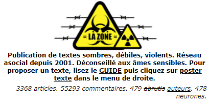
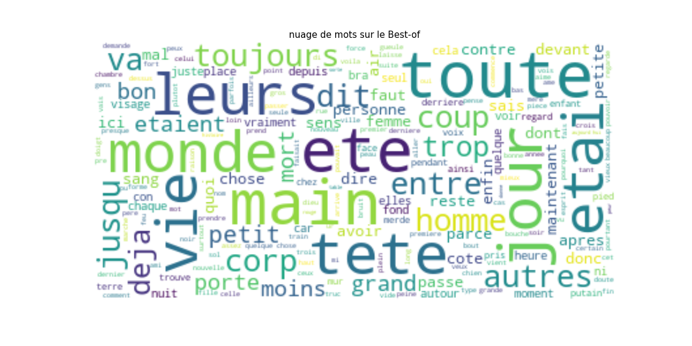
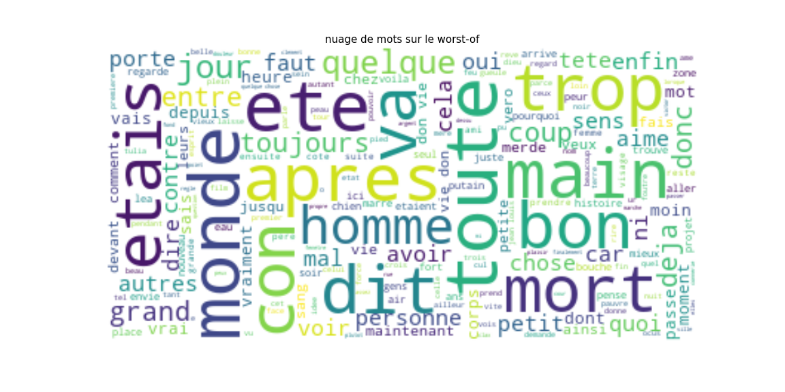
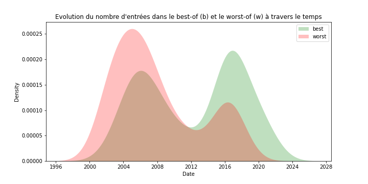
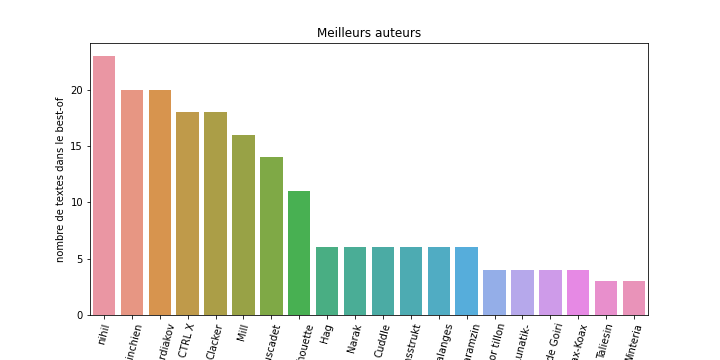
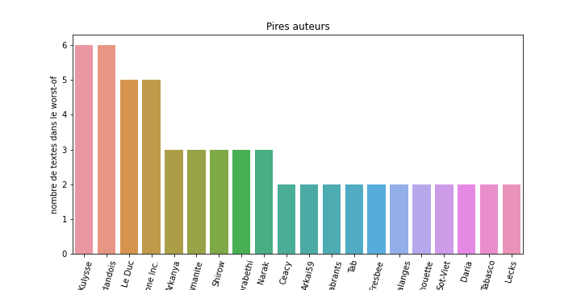
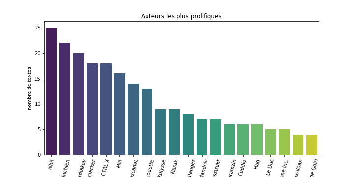

# P27_scraping

# Web Scraping de `lazone.org` avec Selenium et Chrome

### Scraping

Nous allons scraper les textes ayant des meilleures notes (note > 8/10) et les pires (note < 1/10) du site lazone.org.

Nous enregisterons :

- le nom de l'auteur
- le titre de l'oeuvre
- la date
- le résumé
- le texte

Les pages à scrapper sont les suivantes :

page_best_of = "https://www.lazone.org/articles/bestOf.html" 
page_worst_of = "https://www.lazone.org/articles/worstOf.html"

### Choix techniques

_**Selenium**_ : Bien que le premier rôle de Selenium soit le testing de pages webs (développement web), cet outil est beaucoup utilisé pour l’extraction de données. C'est donc un outil très complet pour le scraping, puisqu'il permet de générer un comportement semblable à celui d'un utilisateur humain.

_**MySQL**_ : MySQL est un SGBDR gratuit, de complexité faible et adaptée au stockage de petite taille (ce qui est le cas de notre BDD). 

_**Notebook**_ : Notre BDD n'étant pas appelée à évoluer régulièrement, nous n'actualisons pas nos dataviz en temps réel. Nous construisons donc nos graphes sur un notebook en utlisant les bibliothèques python Matplotlib et Seaborn.

### Dataviz

